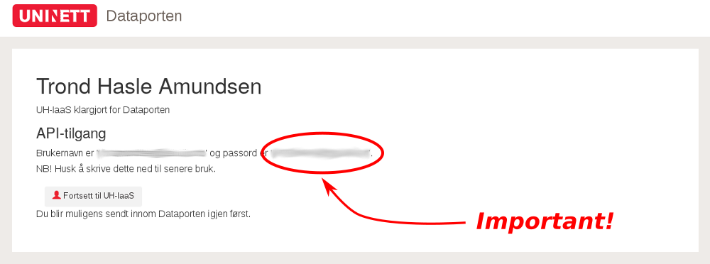

# UH-IaaS documentation

*General documentation* on openstack can be found at <http://iaas.readthedocs.io/en/latest/>.

*User documentation* is at <http://docs.uh-iaas.no/en/latest/>.

There is a *public chat room* where you can get help at <https://uhps.slack.com>.

*Issues should be reported* via the GitHub project norcams/iaas: <https://github.com/norcams/iaas/issues>.

1. [Log in, and get the API password](#API-password)
2. [Set up SSH keys](#Set-up-SSH-keys)
3. [Add a security group to OpenStack](#Add-security-group)
4. [Make a server](#Make-a-server)

## API password

Before you can use UH-IaaS, you need to do some setup.
Go to <https://access.uh-iaas.no/> and follow the steps described at <http://docs.uh-iaas.no/en/latest/login.html#first-time-login>.

```
Important - Copy and save the API password! 
The password for API access is generated and shown here. 
This is the only time that the API password is generated and shown to you.
```


*Image of the screen where you get the API password*

## Set up SSH keys

1. [Check on your local machine for your SSH keys](https://help.github.com/articles/checking-for-existing-ssh-keys/).
2. [SKIP THIS STEP IF YOU HAVE AN SSH KEY] If you do not have an SSH key, create a [new SSH key](https://help.github.com/articles/generating-a-new-ssh-key-and-adding-it-to-the-ssh-agent/).
3. Import your SSH key to openstack. Follow instructions at <http://docs.uh-iaas.no/en/latest/create-virtual-machine.html#setting-up-a-keypair>.

```
 If you have openstack-cli set up you can upload your key from the command line:

 openstack keypair create --public-key ~/.ssh/id_rsa.pub <name of key>
e.g.:
 openstack keypair create --public-key ~/.ssh/id_rsa.pub Dell_XPS15
```
	
## Add security group

You shoud add SSH and ICMP access, as described at <http://docs.uh-iaas.no/en/latest/create-virtual-machine.html#allowing-ssh-and-icmp-access>.

```
If you have openstack-cli set up you can create the security group from the command line:

openstack security group create --description "Allow incoming SSH and ICMP" SSH_and_ICMP
openstack security group rule create --remote-ip 0.0.0.0/0 --dst-port 22 --protocol tcp --ingress SSH_and_ICMP
openstack security group rule create --remote-ip 0.0.0.0/0 --protocol icmp --ingress SSH_and_ICMP

This assumes openstack-cli version 3.x. If you have problems, 
 openstack security group rule create --help
gives help.
On e.g. version 2.x openstack-cli installs, 
 openstack security group rule create --src-ip 0.0.0.0/0 --proto icmp  SSH_and_ICM 
might work.
```

## Make a server

Go to <https://dashboard.uh-iaas.no/dashboard/project/instances/>, press `Launch instance` and build your machine.
Remember to tick "SSH and ICMP" in the Access & Security tab and choose the correct SSH keypair if you have more than one. 
If you struggle, <http://docs.uh-iaas.no/en/latest/create-virtual-machine.html#create-a-virtual-machine> has good documentation. 

Subsequent logins should go via <http://dashboard.uh-iaas.no/>.

The IP address of your instance can be found in your "instances" section. 

```shell
Via the command line, this would be:
- Getting the info we need; images, flavours, networks:
 openstack image list | grep -v deactivated
 openstack flavor list
 openstack network list

- Making a server:
 openstack server create --image "<chosen image>" --flavor <chosen flavor> --security-group SSH_and_ICMP --security-group default --key-name <your key> --nic net-id=<the horribly long ID network number> <name of the server you wish to build>
e.g.:
 openstack server create --image "GOLD Fedora 27" --flavor m1.small --security-group SSH_and_ICMP --security-group default --key-name Dell_XPS15 --nic net-id=dab01c68-c25d-4051-ad5b-7b7b07f16f05 myTestServer
```

We can now check if the machine is working. 
